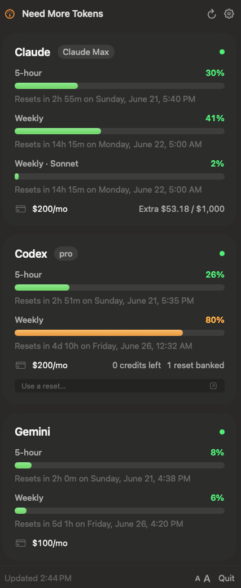

<div align="center">

# Need More Tokens

### *Because you always do.* 🪫



[](LICENSE)
&nbsp;
&nbsp;
&nbsp;
&nbsp;

</div>

A tiny menu-bar gauge for your **Claude · Codex · Gemini · Grok** runway. Glance up; see how much you've got left before something says *limit reached.* 📊

Real native macOS 26. Liquid Glass, no Electron, no web view, no CLI. It reads your usage with native HTTPS clients — your token anxiety stays on your laptop. 🔒

### What you see 👀

Every 5-hour and weekly limit, down to the fiddly ones — Claude's Sonnet weekly, Gemini's Antigravity quota. Your monthly plan, pay-as-you-go credits, and the exact time each window resets. The menu-bar number is whatever's closest to empty, green → amber → red as the runway shrinks.

**Grok / Composer** share one SuperGrok weekly pool, so a single card covers both. NMT reads `cli-chat-proxy.grok.com/v1/billing?format=credits` with the Grok CLI OIDC token (the same `~/.grok/auth.json` `grok login` writes) and refreshes that token itself — it lasts 6 hours, so without a refresh the card goes blank overnight. The card shows the weekly bar plus plan and renewal. Banked SuperGrok usage resets (the "Reset Available" tokens on grok.com Settings ▸ Usage) show as a count on the same card; **Use a reset…** opens that Usage page. NMT never redeems one itself.

Don't want a provider? Flip it off in **Settings ▸ Providers** — it stops fetching and its card disappears. 🎛️

Letters too small? Tap **A+**. It's real type, so it scales crisp, and it remembers. The dollar figures are honest estimates — a nudge, not a bill. It won't do your taxes.

### Run it 🚀

```sh
git clone https://github.com/aylee1024/need-more-tokens
cd need-more-tokens && xcodegen generate && open NeedMoreTokens.xcodeproj
```

macOS 26 + Xcode 26. Build, and it tucks into your menu bar.

<details>
<summary>🔄 Gemini auto-refresh (optional)</summary>

Claude and Codex stay fresh on their own. Gemini's token lasts ~1 hour and only `agy` (Antigravity) refreshes it, so otherwise the card shows *"expired — run agy."* To let NMT do it for you, copy [`gemini-oauth.example.json`](gemini-oauth.example.json) to `~/.config/needmoretokens/gemini-oauth.json` and drop in **agy's own OAuth client** (the one the Keychain token is issued under — capture it from agy's refresh call). No secret ever touches this repo; it lives only on your machine. Skip it and nothing breaks — Gemini just shows "expired" when its token lapses.

</details>

<div align="center">
<br>
Lives quietly in your menu bar. 🛟<br>
Companion to **[lord-claude](https://github.com/aylee1024/lord-claude)** · MIT
</div>
